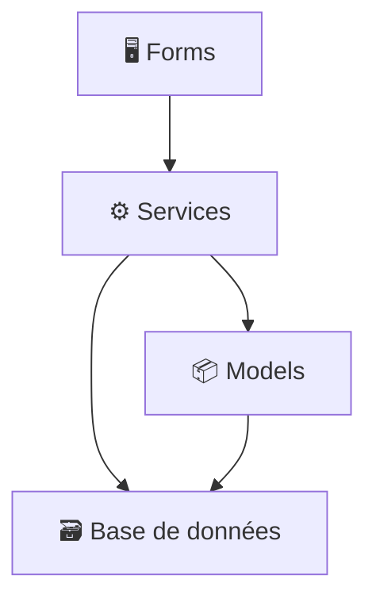

# 🕒 HR Scheduling & Biometric Attendance System

Un système de pointage biométrique complet avec gestion des employés, planification des horaires et contrôle des accès. Développé en **C# WinForms** avec une architecture en **couches classiques**.

## 📁 Structure du projet

```
📦 HRSchedulingSystem
├── Data/
│   └── DatabaseHelper.cs         # Connexion et exécution des requêtes SQL
├── Models/
│   ├── BiometricModels.cs        # Modèles liés aux logs biométriques
│   └── DatabaseModels.cs         # Entités : Employé, Société, Shift, etc.
├── Services/
│   ├── AbsenceService.cs
│   ├── DepartementService.cs
│   ├── EmployeeService.cs
│   ├── PointeuseManager.cs       # Gestion des appareils ZKTeco
│   ├── ProgrammeService.cs       # Gestion des programmes horaires
│   ├── ServiceService.cs
│   ├── ShiftService.cs
│   ├── SocieteService.cs
│   └── ZktecoService.cs          # Intégration SDK CZKEM
├── Forms/
│   └── (Toutes les interfaces WinForms)
├── MainForm.cs                   # Fenêtre principale
└── Program.cs                    # Point d'entrée de l'application
```

## 🧱 Architecture

Le projet suit une architecture en **couches classiques** :



## ✅ Fonctionnalités

- 📌 Pointage biométrique via **SDK ZKTeco**
- 👨‍💼 Gestion des employés, services, départements, sociétés
- 🗓️ Planification d’horaires avec **deux shifts par jour**
- 📊 Export de rapports en **PDF/Excel**

## 🛠️ Technologies utilisées

- 💻 WinForms (.NET 8.0)
- 🛢️ SQL Server 
- 🧰 SDK ZKTeco (CZKEM)
- 📦 Dapper (accès base de données léger)
- 📄 ClosedXML (exports Excel)

## 🚀 Lancement

1. Ouvrir la solution dans **Visual Studio**.
2. Configurer la chaîne de connexion SQL dans `DatabaseHelper.cs`.
3. S'assurer que les DLLs du SDK **ZKTeco** sont présentes (`zkemkeeper.dll`).

## 📷 Capture d'écran

- 💻 Main Form:

- 💻 Collecting Attendance Form:


## 🤝 Auteurs

- **Mostafa** 
- Projet de fin d’études – ESTG - 2025

## ⚖️ Licence

Ce projet est privé pour usage académique uniquement.  
